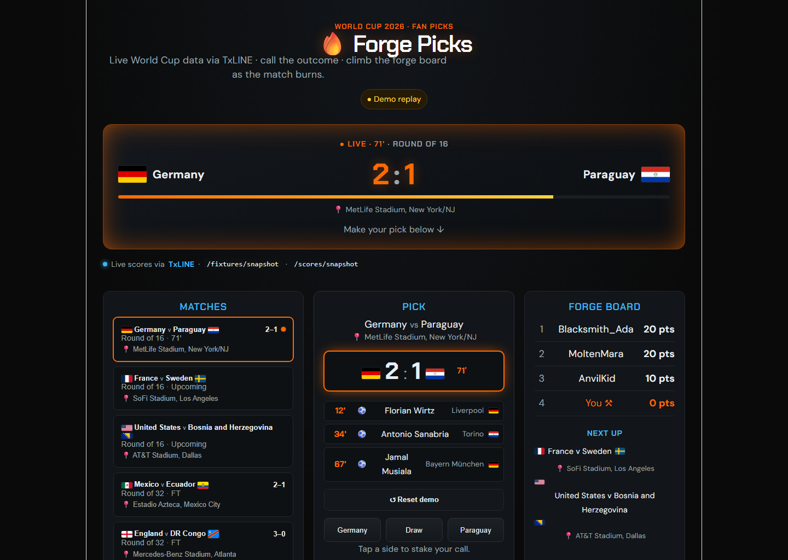

# 🔥 Forge Picks

**Live TxLINE World Cup scores turned into a fan pick game with a forge-themed leaderboard.**
Built for **Superteam Earn × TxODDS** — _Consumer & Fan Experiences_ track.

> Call a match outcome, watch the game unfold live, and climb the Forge Board as results settle in real time.

**▶ Live demo: <https://forge-picks.vercel.app>**



## What it does

- **Live hero** — the featured match with flags, live score, a 0–90' progress bar and your pick.
- **Pick & settle** — call home / draw / away; picks resolve against the real result for **+10 forge points**.
- **Goal timeline** — each scorer with minute, **club**, and a Transfermarkt lookup link (national-team goal ≠ everyday club).
- **Forge Board** — you vs rival typers; the board reshuffles the moment a match hits full time.
- **Match detail** — real WC 2026 host venues (MetLife, SoFi, Estadio Azteca, Mercedes-Benz…) and "Next up" fixtures.
- **Real-time** — polls TxLINE every 2s; a goal fires a banner, a score pop and a hero flash.

## Powered by TxLINE (TxODDS)

Live World Cup scores are cryptographically anchored on Solana by TxLINE. Endpoints used:

| Endpoint | Purpose |
| --- | --- |
| `POST /auth/guest/start` | guest JWT (origin root, no `/api`) |
| `POST /api/token/activate` | API token, after on-chain subscription |
| `GET /api/fixtures/snapshot` | fixtures |
| `GET /api/scores/snapshot/{fixtureId}` | live score events |

The app runs fully in **mock/demo mode** with no tokens, then switches to live data once `.env` is set — **same UI, no code change**.

## Stack

React 19 · Vite · TypeScript · Express (dev API proxy that keeps TxLINE tokens off the browser). No heavy UI dependencies.

## Quick start (mock mode — no tokens needed)

```bash
npm install
npm run dev:all      # Express API on :8787 + Vite on :5173
```

Open <http://localhost:5173>, select **Germany vs Paraguay**, hit **▶ Kick off (demo)** and watch a full match play out in ~90 seconds — goals, timeline, board reshuffle. Use **↺ Reset demo** to replay.

## Live TxLINE data

See [`scripts/txline-activate.md`](scripts/txline-activate.md):

1. `node scripts/get-jwt.mjs` → `TXLINE_GUEST_JWT`
2. Subscribe on-chain in Phantom (free World Cup tier) → activate → `TXLINE_API_TOKEN`
3. Copy `.env.example` → `.env`, fill both tokens → `npm run dev:all`

The badge flips from **● Demo replay** to **● Live data**.

## Scripts

- `npm run dev:all` — API + web (development)
- `npm run build` — TypeScript typecheck + production build
- `npm run lint` — oxlint

## Hackathon checklist

- [x] Public repo
- [x] Deployed URL — <https://forge-picks.vercel.app>
- [ ] Live TxLINE data (`.env` + Phantom)
- [ ] Demo video ≤ 5 min (Loom/YouTube)
- [ ] Brief doc: idea + TxLINE endpoints + API feedback
- [ ] Submit on Earn → **Consumer & Fan Experiences**

## Notes

Demo mode uses real WC 2026 teams and host venues with **simulated** scores, scorers and clubs — all replaced by real TxLINE feeds in live mode. Secrets live only in `.env` (gitignored); nothing sensitive is committed.

---

Built by [PrzemSas](https://gorweld.com) · Data: TxLINE (TxODDS) · Superteam Earn — Consumer & Fan Experiences
